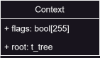

# ls
As simple as listing the files in a directory.

## Sources
 - https://clig.dev/

## Flags

### -a:
Do not ignore entries starting with .

```shell
➜  dir_1 git:(main) ✗ ls
file_1  file_2  file_3
➜  dir_1 git:(main) ✗ ls -a
.  ..  file_1  file_2  file_3  .file_4  .file_5
```

### -l:
Use a long listing format

```shell
➜  dir_1 git:(main) ✗ ls -l
total 0
-rw-rw-r-- 1 user user 0 Feb  8 15:47 file_1
-rw-rw-r-- 1 user user 0 Feb  8 15:47 file_2
-rw-rw-r-- 1 user user 0 Feb  8 15:47 file_3
```

### -r:
Reverse order while sorting

```shell
➜  dir_1 git:(main) ✗ ls -r
file_3  file_2  file_1
```

### -R:
List subdirectories recursively

```shell
.:
dir_1  dir_2  dir_3

./dir_1:
file_1  file_2  file_3

./dir_2:
file_1  file_2  file_3  file_4

./dir_3:
file_0  file_1
```

### -t:
Sort by time, newest first

```shell
➜  samples git:(main) ✗ ls -t
dir_1  dir_3  dir_2
```

## STAGES

### STAGE 1 - 2025/02/08

Parse, sanitize and store all user input into a context struct.
